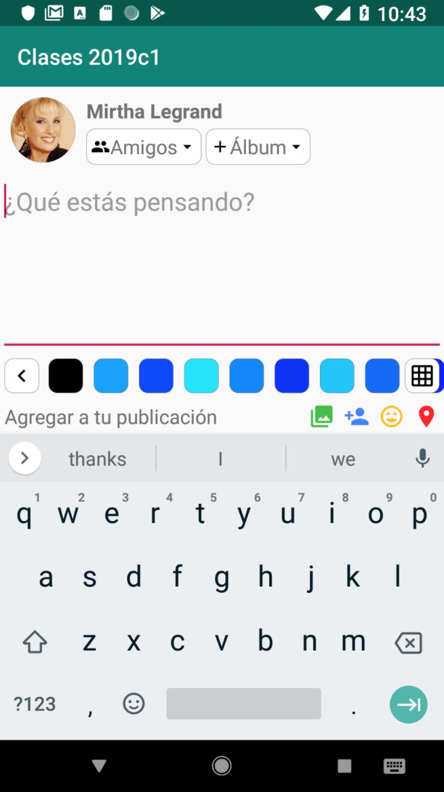

# Clases-2020c1
Prácticas de la materia

## Práctica de layouts

Este proyecto contiene una pequeña aplicación que muestra una pantalla similar a la de una nueva
publicación en Facebook. El layout está incompleto y hay que completarlo para que luzca así:

El layout que vamos a modificar es fragment_status_update.xml. No es necesario cambiar la
estructura del mismo, sino agregar los atributos que hagan falta a los elementos existentes. Si
bien hay más tipos de Layouts distintos, en este ejemplo vamos a ver FrameLayout, LinearLayout
y RelativeLayout.

Los atributos de un elemento que comienzan con `layout_` indican al contenedor cómo debe desplegar
ese elemento. Hay dos obligatorios: `layout_width` y `layout_height` que indican el tamaño que
ocupa esa subvista. Los valores que acepta son dimensiones o alguno de los valores especiales
`wrap_content` (que ajusta al contenido) o `match_parent` (que toma el tamaño del contenedor).
El resto de los atributos `layout_` dependen del tipo de contenedor.

Los atributos que explicamos a continuación se utilizan en la subvista si comienzan con `layout_`
o en el contenedor en caso contrario. De más está decir que no son todos los atributos que van a
encontrar, pero sí los más comunes.

### FrameLayout

Las subvistas se apilan una encima de la otra.

Se puede especificar la alineación de las subvistas
usando el atributo `gravity` (para todas las subvistas) o `layout_gravity` (para una subvista).

### LinearLayout

Las subvistas se despliegan una a continuación de la otra.

El atributo principal es `orientation` (horizontal o vertical). Además de la alineación con
`gravity` y `layout_gravity` (solo en el eje normal al que distribuye) también se puede distribuir
el espacio libre entre subvistas con `layout_weight` y `weightSum`. El espacio que no ocupan las
subvistas sin `layout_weight` se distribuye entre las que sí lo tienen proporcionalmente según su
peso. Si `weightSum` se omite calcula la suma automáticamente.

Se recomienda no usar `match_parent` en las subvistas en el mismo eje donde se distribuyen las
subvistas.

### RelativeLayout

Las subvistas se despliegan en relación al contenedor u otras subvistas. Para cada subvista hay que
indicar al menos una relación para cada eje.

`layout_alignParentStart` (a la izquierda LTR), `layout_alignParentEnd` (a la derecha LTR),
`layout_alignParentTop` (hacia arriba) y `layout_alignParentBottom` (hacia abajo),
`layout_centerHorizontal` (centro horizontal), `layout_centerVertical` (centro vertical) llevan
`true` cuando queremos que la subvista se pegue a alguno de los bordes o centro del contenedor.

Otros atributos `layout_` reciben una referencia a otra subvista. Esto requiere que la subvista a
referenciar tenga un id. Para alinear a otra subvista se usan los atributos `layout_alignStart`,
`layout_alignEnd`, `layout_alignTop`, `layout_alignBottom` o `layout_alignBaseline` (alinea las
bases del contenido). Para poner una subvista al lado de otra se utilizan `layout_toEndOf`,
`layout_toStartOf`, `layout_above` o `layout_below`.
